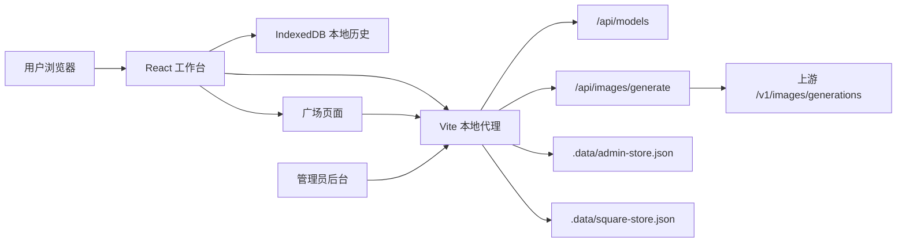

# ImageHub 2.0 / Image Studio

ImageHub 是一个本地优先的 AI 生图工作台，现在包含 `Agent 模式 + 社区广场` 两层体验：用户可以在工作台里用自然语言完成单图、多图和画册类创作，也可以把生成结果推荐到广场，让作品进入发现、点赞、排序和后台治理链路。

它适合创作者、运营团队、市场团队和本地部署场景：既保留手动参数控制，又提供低噪音的 Agent 入口，并通过服务端配额、日志和风控记录让广场行为可追溯。


## 核心能力

- Agent 模式：开启后输入区收敛为上传参考图、参考图带、提示词输入和发送，系统先流式理解意图，再自动编排生成策略。
- 单图 / 多图 / 画册识别：单图高置信度可自动执行，多图和画册任务会先展示拆解面板，用户确认后提交。
- 批量生图：一次提交多张图片，支持并发队列、实时耗时、成功/失败状态和重试。
- 参考图与提示词：支持上传参考图、填写正向提示词和负面提示词，Agent 模式会自动判断参考图使用策略。
- 模型列表自动读取：填写 API Key 后会自动尝试读取模型列表，用户也可以手动刷新。
- 模型选择限制：只允许选择 `gpt-image-2`、`gpt-5.4-image-2` 或名称中包含 `image-2` 的模型。
- 固定 API 入口：前端请求地址只能选择 `https://www.taijiai.online/` 或 `https://bobdong.cn/`。
- 常用宽高比：内置 1:1、4:5、9:16、16:9、21:9 等比例，并自动推导请求尺寸。
- 本地图库：生成结果、提示词、模型、参数、尺寸和耗时保存在当前浏览器 IndexedDB。
- 图片预览：生成完成后可打开大图预览、复制提示词、下载单图或批量下载。
- 广场推荐：成功结果可一键推荐到广场，列表使用最长边 1024 的压缩缩略图，原图仍留在本地历史。
- 广场发现：支持 `最新 / 热门 / 精选 / 本周 / 本月` 视图，初始 20 条，触底继续懒加载。
- 点赞与配额：推荐和点赞都要求配置 API Key；每 key 最多 4 个展示位，每日推荐 10 次，每日点赞 10 次。
- 替换规则：同 key 展示位满 4 张后继续推荐，会替换最早展示项并写入替换日志。
- 管理员后台：查看请求日志、广场概览、推荐趋势、替换率、点赞率、拒绝原因和风控事件，并支持按天导出广场明细。

## 产品页面

### 工作台

中间区域以平铺画廊展示生成记录，右侧配置 API、模型、宽高比、质量、格式、张数与并发，底部输入区用于提示词和参考图。开启 Agent 模式后，界面会隐藏大部分参数噪音，让用户专注描述任务。


### 图片预览

生成完成后可以进入预览模式，查看原图比例、尺寸、生成参数和提示词；成功图片可直接推荐到广场。


### 首页

首页用于介绍项目能力，并提供进入工作台、广场和管理后台的入口。


### 广场

广场是创作展示与分发层。作品以 1K 缩略图展示，卡片包含标题、Prompt 标签、模型、参数、尺寸、来源和点赞数；用户可以复制提示词、打开展示图或点赞。

广场入口：

```text
http://localhost:8877/#square
```

### 管理后台

管理员可以查看生成请求统计、成功率、失败分布和日志明细，也可以查看广场展示数、推荐尝试、替换率、点赞数、拒绝原因和风控事件。


## 系统架构



## 数据与隐私策略

ImageHub 仍然采用 local-first 设计，但广场推荐是一个明确的发布动作：

- 生成图片 Blob 默认只保存在当前浏览器 IndexedDB。
- 本地历史保存生成提示词、模型、参数、尺寸、耗时和错误详情。
- 服务端管理员日志记录请求元信息和结果状态，不记录 API Key 原文。
- API Key 作为当前版本身份凭证，服务端只保存哈希值用于配额、点赞和风控。
- 用户推荐到广场后，服务端会保存 1K 压缩缩略图、提示词、模型、参数和来源信息。
- 原图不进入广场存储，仍保留在本地历史/预览中。
- 广场推荐、替换、拒绝、点赞、取消点赞、风控事件会写入 `.data/square-store.json`。
- `.data/admin-store.json` 和 `.data/square-store.json` 都是本地运行时数据，已通过 `.gitignore` 排除。

## 业务规则

广场当前按 API Key 哈希识别用户身份：

| 规则 | 当前默认值 |
| --- | --- |
| 单 key 总展示位 | 4 张 |
| 单 key 每日推荐额度 | 10 次 |
| 单 key 每日点赞额度 | 10 次 |
| 广场分页 | 每次最多 20 条 |
| 缩略图尺寸 | 最长边 1024，不放大小图 |
| 日切时区 | `Asia/Shanghai` |

推荐行为：

- 展示位未满 4 张时直接加入广场。
- 展示位已满且日额度未超时，替换最早展示项。
- 日推荐额度超限时拒绝。
- 重复推荐同 key 的同图会拒绝，避免刷占展示位。

点赞行为：

- 首次点赞消耗 1 次日点赞额度。
- 重复点赞是幂等 `noop`，不重复扣额度。
- 取消点赞不消耗新额度。
- 点赞超限时拒绝并返回剩余额度。

## 管理员系统

后台地址：

```text
http://localhost:8877/#admin
```

默认管理员：

```text
用户名：admin
密码：admin123456
```

首次登录后系统会要求重置密码。也可以通过环境变量配置初始管理员：

```bash
ADMIN_USERNAME=admin ADMIN_INITIAL_PASSWORD=your-password npm run dev
```

管理员后台能力：

- 查看总请求数、成功率、失败数、平均耗时。
- 查看模型使用分布和常见失败原因。
- 按状态和关键词筛选请求日志。
- 查看请求 `requestId`，便于和用户侧错误对齐排查。
- 查看广场活跃展示数、推荐尝试、替换率和点赞数。
- 查看广场今日推荐、点赞、替换、拒绝趋势。
- 查看广场拒绝原因 Top 和风控事件。
- 按天导出广场推荐 / 点赞 / 替换 / 拒绝明细，支持 JSON 和 CSV。

## 本地启动

项目使用 Vite + React + TypeScript，默认端口固定为 `8877`。

```bash
npm install
npm run dev
```

打开：

```text
http://localhost:8877/
```

构建生产包：

```bash
npm run build
```

本地预览：

```bash
npm run preview
```

## 使用流程

### 标准模式

1. 打开首页并进入工作台。
2. 在右侧配置区选择 API URL。
3. 填写 API Key，系统会在停止输入 1 秒后静默尝试读取模型列表。
4. 选择可用的 `image-2` 模型。
5. 设置宽高比、质量、格式、张数、并发和 Seed。
6. 输入提示词，必要时上传参考图。
7. 点击生成，任务会进入中间画廊并显示实时耗时。
8. 生成完成后可以预览、复制提示词、下载图片或推荐到广场。

### Agent 模式

1. 在输入区开启 Agent 模式。
2. 上传参考图并输入自然语言需求。
3. 系统流式分析意图，展示理解进度和策略预览。
4. 单图高置信度任务自动执行。
5. 多图和画册任务先展示任务拆解，确认后统一提交。
6. 任务提交后 Agent 面板默认收起，结果进入画廊。
7. 需要调整策略时可点击重新分析。

### 广场

1. 生成成功后，在结果卡片或预览弹窗中点击推荐到广场。
2. 服务端生成推荐记录，并返回新增、替换或拒绝状态。
3. 打开 `#square` 浏览最新、热门、精选、本周或本月内容。
4. 配置 API Key 后可以点赞或取消点赞。
5. 管理员可在后台查看配额、替换、拒绝和风控日志。

## 本地 API

生成与模型：

```text
POST /api/models
POST /api/images/generate
POST /api/analyze-prompt
POST /api/agent-mode/analyze
```

广场：

```text
GET  /api/square/feed?tab=latest|hot|top_day|top_week|top_month&cursor=&limit=20
GET  /api/square/quota?apiKey=
POST /api/square/recommend
POST /api/square/like
GET  /api/square/admin/overview
GET  /api/square/admin/export?format=json|csv&dateKey=YYYY-MM-DD
```

管理员：

```text
GET  /api/admin/me
POST /api/admin/login
POST /api/admin/logout
POST /api/admin/change-password
GET  /api/admin/stats
GET  /api/admin/requests
GET  /api/admin/logs/export
```

上游图片生成请求使用 OpenAI 兼容格式，核心端口为：

```text
/v1/images/generations
```

## 技术栈

- React 19
- TypeScript
- Vite 6
- lucide-react
- IndexedDB
- Vite dev middleware proxy
- 本地 JSON 管理员日志存储
- 本地 JSON 广场存储

## 适用场景

- 电商商品图批量探索
- 社媒封面和短视频封面生成
- 海报、场景图、人物图方向测试
- 官网头图、活动视觉和销售物料生成
- 多图异构创意拆解
- 宣传画册 / 彩页初稿探索
- 团队内部作品展示与复用提示词
- 多模型服务的生图接口验证
- 本地保留生成历史和失败排查记录

## 开发说明

仓库中的运行时数据不会提交：

```text
dist/
node_modules/
.data/
generated_images/
screenshot-*.png
```

README 中使用的项目截图保存在：

```text
docs/screenshots/
```
